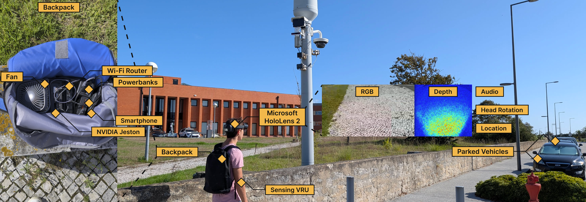

# UrbanEgo: A Multimodal First-Person Urban Perception Dataset

**UrbanEgo** records urban environments from the viewpoint of a walking pedestrian wearing a Microsoft HoloLens 2 and a backpack containing an NVIDIA Jetson edge computer. It combines egocentric RGB video with long-throw depth, infrared frames, head pose, heading, orientation angles, and two independent GPS sources. An offline road-user detection and tracking layer accompanies the sensor recordings.

The collection consists of **eight runs**, approximately **2 h of recording sessions** and **8 GB** of data. The data were collected in **Aveiro, Portugal**, between May and July 2026. All runs were recorded by one researcher during daytime and fair weather.



[Watch the acquisition and data-collection demo on YouTube](https://youtu.be/-RTJkzZOtU8).

## Research uses

UrbanEgo provides a pedestrian perspective for research on:

- Egocentric object detection, 3D scene understanding, and depth completion.
- Outdoor localization, pedestrian route analysis, and map matching.
- Wearable sensing and augmented reality for pedestrian safety.
- Pedestrian contributions to cooperative perception.

The GPS, heading, available phone speed, and detection streams provide ingredients for experiments with Collective Perception Messages (CPMs). Generating object positions and velocities requires additional processing. Depth can support nearby objects; objects beyond its range require further estimation.

## Recording routes

The runs cover three types of urban environment: the University of Aveiro campus and adjacent streets, the Rua da Pêga lakeside arterial, and the touristic city center.

Session duration spans the earliest to latest sensor timestamp in each run; RGB duration is the exported MP4 video-track duration. Durations are rounded to the nearest second; sizes use decimal GB (10⁹ bytes). Folder dates and times are UTC. Some GPS streams continue after the video ends.

| Run | Date | Session start (UTC) | Session duration | RGB duration | Size (GB) | Route |
|---:|---|---|---:|---:|---:|---|
| 1 | 2026-05-06 | 15:26:21 | 29m 45s | 29m 39s | 1.879 | University campus loop, five marked crossings and a roundabout |
| 2 | 2026-05-06 | 16:39:35 | 11m 08s | 11m 04s | 0.660 | Rua da Pêga, a quieter out-and-back lakeside route |
| 3 | 2026-05-07 | 15:19:20 | 17m 02s | 16m 57s | 1.098 | Campus, surrounding streets, and hospital roundabout |
| 4 | 2026-07-01 | 12:47:34 | 11m 08s | 11m 04s | 0.626 | Repeat of the Run 2 lakeside route |
| 5 | 2026-07-13 | 17:35:11 | 20m 01s | 18m 13s | 1.144 | Repeat of the Run 3 campus and hospital route |
| 6 | 2026-07-14 | 16:15:37 | 18m 48s | 14m 58s | 0.848 | Ponte dos Botirões, with dense vehicle traffic |
| 7 | 2026-07-14 | 17:14:27 | 16m 03s | 15m 58s | 0.915 | Rossio, beside the canal, with the highest pedestrian density |
| 8 | 2026-07-14 | 17:41:38 | 10m 23s | 10m 19s | 0.615 | Praça do Peixe, a pedestrian-dense historic square |

For pedestrian-rich scenes, start with **Runs 7 and 8**. Vehicle-rich scenes are found in **Runs 3, 4, and 6**. **Run 1** combines moderate pedestrian and vehicle traffic with the highest cycling activity. Repeated routes allow comparisons between recordings made on different days.

## Data included

Each run is self-contained in a folder named `runN_YYYYMMDD_HHMMSS`, where `N` identifies Run 1 through Run 8. The release uses standard formats that can be read with common libraries.

| File or folder | Content | Format and approximate rate |
|---|---|---|
| `rgb.mp4` | Egocentric RGB video with stereo audio | H.264, 1280×720, fixed 20 fps; AAC, 48 kHz |
| `rgb_frames.jsonl` | Retained camera-frame timestamps, head pose, camera intrinsics, and capture settings | JSON Lines, variable camera rate (~19–24 Hz) |
| `depth/` | Distance to surfaces in millimetres; zero indicates no measurement | 16-bit PNG, 320×288, 5 fps |
| `ab/` | Active-brightness infrared images matching the depth frames | 16-bit PNG, 320×288, 5 fps |
| `depth_frames.jsonl` | Depth-frame timestamps and head pose | JSON Lines, per depth frame |
| `calibration/` | Depth intrinsics, extrinsics, and per-pixel ray table | JSON and CSV, per run |
| `gps_vam.jsonl` | Hardware GPS receiver positions | JSON Lines, 0.8 Hz |
| `gps_phone.jsonl` | OwnTracks smartphone positions, altitude, and speed | JSON Lines, 0.8 Hz |
| `heading.jsonl` | Corrected head heading, degrees clockwise from North | JSON Lines, 13 Hz |
| `imu.jsonl` | Head orientation: yaw, pitch, and roll in degrees | JSON Lines, 13 Hz |
| `yolo/` | Automatic road-user detections, frame counts, and processing metadata | JSON Lines and JSON |
| `manifest.json` | Run identifiers, stream counts, and file layout | JSON, per run |

### Aligning the streams

The release manifests use metadata layout version `2`, which separates original acquisition counts, retained RGB metadata rows, and actual exported MP4 frames. `rgb_source_frames` preserves the original count; `rgb_metadata_frames` counts sidecar/YOLO frames; `rgb_encoded_frames` and `rgb_fps` describe the MP4. `rgb_duration_s` describes RGB video duration and `session_duration_s` describes the span across sensor streams. This layout version is separate from the eventual Zenodo dataset release version.

Sensor JSONL records carry a per-stream sequence number (`seq`), a wall-clock timestamp (`ts_unix_ns`, nanoseconds since the Unix epoch), and a monotonic timestamp (`ts_mono_ns`). YOLO records use a different schema: `frame`, `t`, and `ts_ns`. The YOLO `frame` and `ts_ns` values refer to the retained RGB metadata sequence and its `ts_unix_ns` values; they are not indices into the exported 20 fps MP4. Associate detections with the camera metadata by timestamp, then use timestamps to match other sensor streams.

In Runs 4–8, phone records can include `source_ts_ns` (a producer timestamp stored in nanoseconds), and receiver records can include `generation_delta_time` (producer timing metadata). Their clock mapping and the receiver field's units and wrap convention have not been confirmed from the export code. Use `ts_unix_ns` for cross-stream alignment.

Video playback time and session time can have different starting points. The streams also have different rates and may start or end at different times, so alignment should use the recorded timestamps rather than a shared time-zero assumption.

### Object detections

The detection layer is computed offline from the recorded camera stream using **YOLO11x** and **BoT-SORT with appearance re-identification**. It groups road users into pedestrians, bicycles, and vehicles (cars, motorcycles, buses, and trucks).

- `detections.jsonl`: one tracked-object record per frame, including class, confidence, track identifier, and a pixel bounding box.
- `frames.jsonl`: one record per frame, including empty frames, with group and class counts.
- `meta.json`: processing parameters and run-level metadata.

Per-frame density measures detector output independently of tracking identities. Unique-object counts and flow rates are approximate: missed detections, track fragmentation, ID switches, and repeated observations affect the totals. Repeated observations can inflate them.

## Limitations and privacy

- **Collection scope:** the collection does not cover night-time, adverse weather, or systematically varied pedestrian behaviour.
- **Automatic labels:** detections and tracks are an automatic baseline and can contain errors.
- **Privacy:** released RGB video is processed with automatic face and vehicle licence-plate blurring. The process can miss identifiable content, so residual identifiable content may remain.
- **Calibration and coordinates:** pose and calibration matrices refer to local HoloLens tracking/sensor frames, not WGS-84 coordinates. Confirm the coordinate convention, matrix multiplication order, and transform direction before projecting points between camera, rig, and world frames.
- **Image representation:** depth and infrared images are stored as lossless 16-bit PNG files; lossless PNG storage does not by itself establish bit-exact equality with the original sensor stream.

## Citations

Please cite both the accompanying paper and the Zenodo dataset record when using UrbanEgo.

### Paper

```bibtex
@article{urbanego_paper,
  title   = {UrbanEgo: A Multimodal First-Person Urban Perception Dataset},
  author  = {Abreu, Rodrigo and Clérigo, André and Silva, Gonçalo and Rito, Pedro and Sargento, Susana},
  journal = {[JOURNAL]},
  year    = {[PUBLICATION_YEAR]},
  doi     = {[PAPER_DOI]}
}
```

### Dataset (Zenodo)

Use the title, creators, version, and DOI from the Zenodo record for the dataset release used.

```bibtex
@dataset{urbanego_dataset,
  title     = {[ZENODO_RECORD_TITLE]},
  author    = {[ZENODO_RECORD_CREATORS]},
  year      = {[DATASET_PUBLICATION_YEAR]},
  publisher = {Zenodo},
  version   = {[DATASET_VERSION]},
  doi       = {[ZENODO_DATASET_DOI]},
  url       = {https://doi.org/[ZENODO_DATASET_DOI]}
}
```

## Licence

The UrbanEgo dataset and this website are licensed under the [GNU General Public License v3.0 (GPL-3.0-only)](LICENSE).
